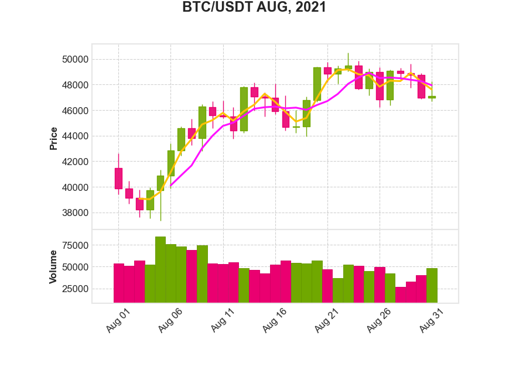

<header>
Things to Do
============
</header>

# Binance-API-with-python

 ### To follow the material of this repository you will need to:
  * Have an account on Binance, [here](https://python-binance.readthedocs.io/en/latest/index.html) you can create one
  * Create an API key within your Binance account. You must follow [these steps](https://www.binance.com/en/support/faq/360002502072).
  * Install python-binance (which is as simply as making `!pip install python-binancecode`)
